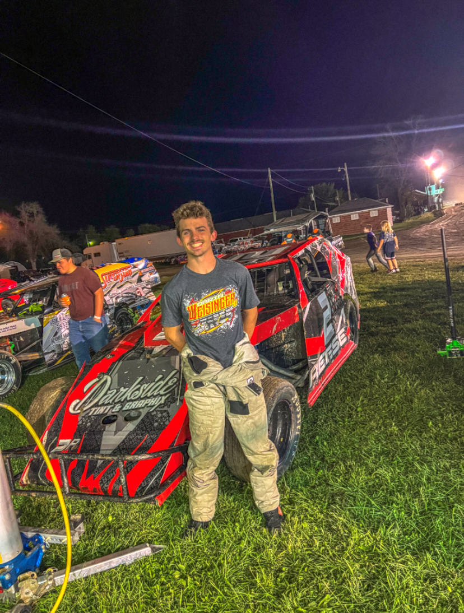

# Fisher Reese 
I am from Memphis, MO and went to Adair County RII high school in Brashear, MO.  
Some interesting facts about me would be I played basketball, baseball, track, academic bowl, and  
participated in clubs such as FFA, FBLA, NHS. Outside of high school some of my hobbies are working  
on cars, hunting, fishing, and driving a racecar on the weekends. 
 
**[PicOfMeLink](images/PicOfMe.PNG)**

***

### Countries To Visit
I have been to quite a few different countries over the years, some I had alot of fun in whereas others were  
scary at times and dangerous. When traveling it is a great idea to checkout the neighborhood/area you are going  to and not just the resort you are staying at. The resort could look very nice and pretty but when you adventure 
outside your resort it could be very dangerous and unwelcoming. 
| Mexico | Italy | Spain | Greece |
|:------------:|:------------:|:------------:|:------------:|
| Cheap and Fun | Good Food | Good Hiking Trails | Rich Heritage |
| 7 days | 4 days | 5 days | 4 days|

***

### Funny Quotes 
>"If you aint first your last" ~ **Ricky Bobby**  
>"Life's a garden, dig it" ~ **Joe Dirt**
